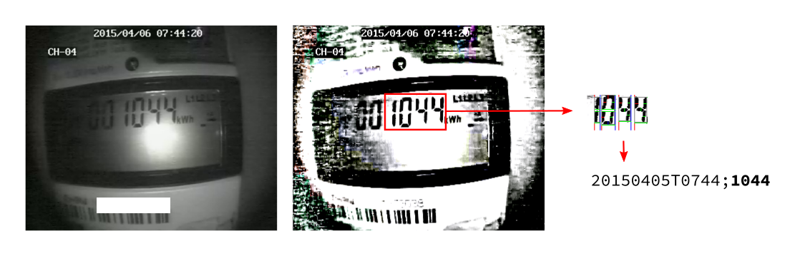

# estats

I needed to automatically read an eletricity meter's value. This tends to
be straight-forward with modern meters - most have infrared interfaces - but
unfortunately, the only input I have in this case is an analog, low-resolution 
wireless camera attached to a random Chinese video server. To make things worse,
the wireless connection is noisy and the image is distorted most of the time.

After a few hours of fiddling, I ended up with this ~~atrocity~~ surprisingly 
functional hack. It was really fun figuring this out and I'm documenting it here 
just in case it helps someone who needs to do something similar.

The video server turned out to support RTSP, but only if you send it a hardcoded
login message first. One throwaway VM to install the vendor's unsigned
ActiveX applet (downloaded straight from the camera) later, I had a packet capture.

Of course, there's no security whatsoever and we can just replay the initial packet.

Since this is the only thing we need to send to the camera, we can just pipe the
login message into netcat and let ffmpeg sort out the rest, telling it to grab a
single frame and write it out to pic.png:

    cat login_msg.bin | nc -q -1 $1 9000 | ffmpeg -t 1 -i - -y -vframes 1 pic.png

Unfortunately, the camera picture has very low contrast and needs to be pre-
processed before we can do anything useful with it. NASA's [Retinex](https://dragon.larc.nasa.gov/) 
turns out to be exactly what we need, and it's implemented in GIMP.

GIMP, it turns out, can be automated using its embedded Python interpreter:

    gimp --no-interface --no-splash --no-data --no-fonts --batch-interpreter python-fu-eval \
      -b 'img = pdb.gimp_file_load("pic.png", ""); \
      drawable = pdb.gimp_image_get_active_layer(img); \
      pdb.plug_in_retinex(img, drawable, 250, 3, 1, 0.3); \
      pdb.file_png_save(img, drawable, "pic_retinex.png", \
      "raw_filename", 0, 9, 0, 0, 0, 0, 0); pdb.gimp_quit(1)'

This looks a lot better! We can then feed the output into the amazing 
[ssocr](https://github.com/auerswal/ssocr) tool, which is a OCR tool for seven-segment displays. 
The camera doesn't move and neither does the meter, so we can hardcode the crop values:

    ssocr -d -1 -i 2 -D rotate 4 crop 130 100 85 50 pic_retinex.png

Amazingly, this returns the correct value some of the time.

